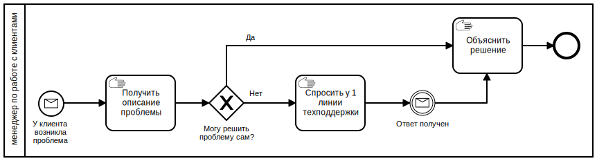

# BPMN — Business Process Model and Notation {#bpmn}

**BPMN** — это стандарт графического моделирования бизнес-процессов, разработанный **Object Management Group (OMG)**. Он предназначен для унифицированного описания процессов, понятного **бизнесу**, **аналитикам** и **разработчикам**.

---

## 🎯 Назначение BPMN

- Визуализация бизнес-процессов  
- Анализ и оптимизация процессов  
- Коммуникация между бизнесом и разработчиками  

---

## 🔹 Основные типы элементов

| Элемент                              | Значок   | Назначение                               |
| ------------------------------------ | -------- | ---------------------------------------- |
| **Событие (Event)**                  | ○        | Начало, конец, или промежуточное событие |
| **Действие (Activity)**              | ▭        | Описание задачи или процесса             |
| **Шлюз (Gateway)**                   | ⬠ (ромб) | Ветвление или объединение потока         |
| **Поток управления (Sequence Flow)** | →        | Связывает элементы                       |

---

## 🚩 Типы событий (Events)

### 📍 Стартовые события

-  **Начало процесса**  
  _(обычное, с сообщением, с таймером и др.)_

### 🔁 Промежуточные события

- что-то происходит между действиями  
  _(например: ожидание ответа, получение сигнала, задержка)_

### ⛔ Завершающие события

- завершает выполнение процесса

---

## ✅ Действия

- Виды:
  - элементарные - задачи
  - составные - подпроцессы, включающие несколько подзадач
BPMN предполагает следующие графические отображения для основных типов действий:

| Значок                                                                          | Наименование                          | Назначение                                                                                                                                                         |
| ------------------------------------------------------------------------------- | ------------------------------------- | ------------------------------------------------------------------------------------------------------------------------------------------------------------------ |
|                        | Абстрактная задача                    | Используется для обозначения простого действия или операции, не имеющей дальнейшей декомпозиции в рамках текущего бизнес-процесса                                  |
|            | Подпроцесс                            | Используется для отображения декомпозированного процесса, существующего в рамках рассматриваемого процесса. Подпроцесс описан более подробно на своей диаграмме    |
|  | Вызов повторно используемого действия | Используется для отображения процесса, являющегося частью рассматриваемого процесса, но хранящегося в отдельном файле. Может использоваться в нескольких процессах |

---

## 🔀 Шлюзы (Gateways)

Шлюзы управляют **разветвлением**, **синхронизацией** и **объединением потоков**. Вот ключевые типы:

### 1. Исключающий шлюз (**Exclusive Gateway (XOR)**) {#exclusive-gateway}

- Пропускает **только один** исходящий путь  
- Обычно сопровождается условиями (Если / Иначе)

🔧 Обозначение: пустой ромб (или с "X")

**Пример:**

---

### 2. Параллельный шлюз (**Parallel Gateway (AND)**) {#parallel-gateway}

- Все выходящие потоки **запускаются одновременно**  
- Все входящие потоки **ожидаются до продолжения**

🔧 Обозначение: ромб с плюсом “+”

**Пример:**  

---

### 3. Событийный шлюз (**Event Gateway**) {#event-gateway}
Используется для развилки по потенциальным событиям

🔧 Обозначение: ромб с кругом и пятиугольником

**Пример:**

---

### 4. Комплексный шлюз (**Complex Gateway**) {#complex-gateway}

- Используется в **нестандартных логиках** (например: "ждать 2 из 3 потоков")

🔧 Обозначение: ромб с звёздочкой 
**Пример:**  

---

## 🧩 Виды диаграмм BPMN

В BPMN существует 4 вида диаграмм:

- Процесс (Process Diagram)
- Взаимодействие (Collaboration Diagram)
- Хореография (Choreography Diagram)
- Диалог (Conversation Diagram)

Первые три вида диаграмм являются основными, а четвертый вид – «Диалог» – является дополнительным и появился лишь в **BPMN 2.0**. На практике чаще всего используют 2 вида диаграмм: диаграммы «Процесс» и «Взаимодействие». Рассмотрим назначение всех видов диаграмм:

### Процесс (Process Diagram)

Описывает содержание и логику **бизнес-процесса BPMN** в виде потока задач, условий и событий. Это самый распространенный, часто применяемый вид диаграмм, он является основой **нотации BPMN**. Пример:

### Взаимодействие (Collaboration Diagram)

Позволяет моделировать взаимодействие (обмен данными) между двумя или более **бизнес-процессами BPMN**. Для графического отображения такого взаимодействия используются потоки сообщений (message flow). Пример:

### Хореография (Choreography Diagram)

Иногда диаграммы “Взаимодействие” оказываются слишком сложными для восприятия и требуют более наглядного представления. В этом случае применяют диаграммы хореографии. Они описывают поток (последовательность) взаимодействий участников при **выполнении бизнес-процессов BPMN**. Пример:

### Диалог (Conversation Diagram)
Является еще одним вариантом диаграммы для визуализации **взаимодействий бизнес-процессов BPMN** и их участников. Диаграмма “Диалог” описывает процессный ландшафт и взаимодействия верхнего уровня между вовлеченными сторонами. Пример:

---

## 👥 Участники (Pools и Lanes)

- Пул (**Pool**) — участник процесса (организация, система)  
- Дорожка (**Lane**) — подразделение или роль в пуле

→ Используются для визуального отображения ответственности

---

## 🛠 Инструменты для BPMN

| Инструмент          | Описание                                                    |
| ------------------- | ----------------------------------------------------------- |
| **Camunda Modeler** | Бесплатный, поддерживает BPMN 2.0                           |
| **Stormbpmn**       | Частично бесплатный, поддерживает BPMN 2.0 и проверку схемы |
| **Bizagi Modeler**  | Удобный GUI, экспорты в Word/PDF                            |
| **Draw.io**         | Простой онлайн-инструмент                                   |
| **Visual Paradigm** | Поддержка BPMN + UML                                        |

---

## Вопросы на собеседовании  
- **Вопрос:** Что такое BPMN и зачем она нужна в бизнес-анализе?  
  **Пример ответа:** 
    - “[BPMN](#bpmn) — это стандарт нотации для моделирования бизнес-процессов, который позволяет визуализировать и анализировать процессы, а также строить общую модель, понятную как бизнес, так и IT.”  
- **Вопрос:** Назовите разные типы шлюзов в BPMN и поясните их применение.  
  **Пример ответа:** 
    - [Исключающий шлюз](#exclusive-gateway) используется, когда только один из путей может быть выбран; 
    - [параллельный шлюз](#parallel-gateway) — когда нужно запустить сразу несколько путей; 
    - [событийный шлюз](#event-gateway) — для ветвления на основе наступления событий; 
    - [комплексный шлюз](#complex-gateway) — когда логика ветвления более сложная, например, “ожидать два из трёх”.

---

## 📚 Полезные ресурсы

- [BPMN 2.0 Specification (OMG)](https://www.omg.org/spec/BPMN/)
- [Camunda BPMN cheatsheet](https://camunda.com/bpmn/cheat-sheet/)
- [Онлайн-редактор BPMN](https://demo.bpmn.io)
- [Все элементы BPMN с описанием](https://stormbpmn.com/bpmn/elements)
- [Обзор всех видов диаграмм BPMN](https://bpmn20.ru/docs/docly-documentation/obzor-vseh-vidov-diagramm-bpmn/)

---