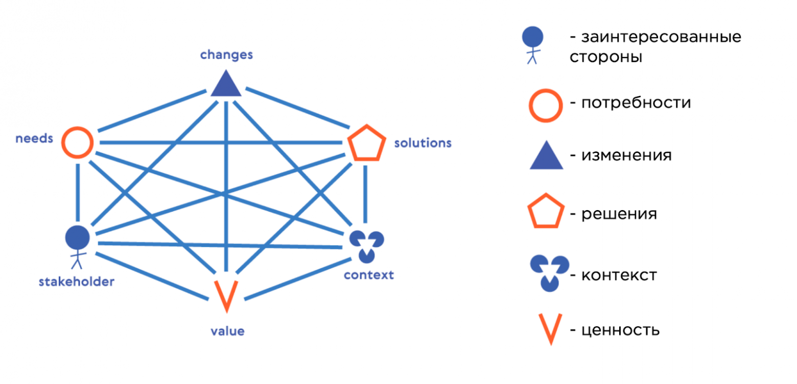

# Бизнес-анализ

**Бизнес-анализ** — это деятельность, которая делает возможным проведение изменений в организации, приносящих пользу заинтересованным сторонам в определенном контексте, путём выявления потребностей и обоснования решений, описывающих возможные пути реализации этих изменений.

## Модель базовых понятий бизнес-анализа

## Связь основных понятий

### 1. Контекст (Context) {#context}
это совокупность фактов и обстоятельств, в окружении которых происходит какое-то событие или существует явление/объект; это то, что нас окружает.
   
- Связь с [Потребностями](#needs): Потребности зачастую дают о себе знать, когда они перестают удовлетворяться в результате непреднамеренных изменений, чаще всего происходящих во внешнем контексте. Осознание потребности очень сильно зависит от контекста.
- Связь с [Решениями](#solution): Решения по удовлетворению потребностей очень контекстно-зависимы. Одно и то же решение в разных контекстах работает совершенно по-разному. Контекст сильно влияет на выбор решения, часто накладывая ограничения. После реализации, решение само становится частью контекста.
- Связь с [Ценностью](#value): Польза/ценность решения не абсолютна и сильно зависит от контекста; изменение контекста может сильно изменить или даже обнулить ценность.
- Связь с [Заинтересованными сторонами](#stakeholders): Люди (заинтересованные стороны) являются неотъемлемой частью контекста и оказывают на него непосредственное влияние.

### 2. Потребности (Needs) {#needs}
Потребность может существовать объективно, независимо от того, выявлена ли она или осознана. Чаще всего потребность дает о себе знать, когда она перестает удовлетворяться. Например потребность в дыхании.

- Как определяются: Неудовлетворение потребности происходит, как правило, в результате изменений, происходящих во внешнем контексте.
- Переход к [Требованиям](#needs) и [Ценности](#value): Осознанная потребность формулируется в виде требования. Требование – это высказанная потребность, которая фокусируется на пользе/ценности, которую человек получит при её реализации.
- Связь с [Решением](#solution): Решение – это то, что позволяет удовлетворить потребность, указанную в требовании.

### 3. Изменение (Change) {#change}
ключевое слово в бизнес-анализе. Главная цель реализации решения — удовлетворение потребности, которое осуществляется через проведение изменения.

- Типы и их связь с [Контекстом](#context):
    - Непреднамеренные изменения: Происходят независимо от нашего желания, чаще всего вопреки ему, и происходят во внешнем контексте. Именно эти изменения часто приводят к тому, что существующие потребности перестают удовлетворяться, вызывая их осознание.
    - Преднамеренные изменения: Это изменения, которые осознанно инициируются для реализации выбранного решения.
- Связь с [Решением](#solution) и [Ценностью](#value): Преднамеренные изменения позволяют получить пользу/ценность и помогают внедряемому решению реализовать его ценность, максимально удовлетворяя потребность. Изменения, как и решения, должны проводиться с учетом контекста.

### 4. Решение (Solution) {#solution}
это то, что позволяет удовлетворить потребность, указанную в требовании.

- Как определяются/выбираются: Для удовлетворения одной потребности может существовать множество решений. Выбор решения очень сильно зависит от контекста, который часто накладывает ограничения.
- Связь с [Изменением](#change): Удовлетворение потребности через решение осуществляется посредством проведения преднамеренных изменений.
- Связь с [Контекстом](#context): После реализации, решение становится частью повседневной работы организации и переходит в контекст для новых изменений или решений.
- Связь с [Ценностью](#value): Решение позволяет получить пользу/ценность, ради которой оно было реализовано.

### 5. Ценность (Value) {#value}
это значимость, важность или полезность чего-либо для кого-либо (человека, группы людей, компании) в конкретном контексте.

- Как определяются: Наиболее стандартным критерием определения ценности решения является то, насколько решение максимально удовлетворяет потребность, ради которой оно было реализовано.
- Связь с [Требованием](#needs): Требование сфокусировано на той пользе/ценности, которую человек получит, когда оно будет реализовано.
- Связь с [Решением](#solution) и [Изменением](#change): Решение позволяет получить эту ценность. Проведение изменений должно приносить пользу, помогая решению реализовать его ценность.
- Связь с [Контекстом](#context): Ценность не является абсолютной величиной и сильно зависит от контекста.

### 6. Заинтересованные стороны (Stakeholders) {#stakeholders}
это те, кому приносятся польза/ценность от изменений, осуществляемых бизнес-анализом.

- Как определяются: В определении профессии бизнес-анализа указано, что его деятельность приносит пользу заинтересованным сторонам. Они выражают свои потребности (например, через user story).
- Связь с [Контекстом](#context): Заинтересованные стороны (люди) являются неотъемлемой частью контекста и оказывают на него непосредственное влияние. Их потребности необходимо учитывать при разработке или выборе решения, так как их неучет может привести к негативным отзывам.

## Полезные ресурсы

Источники:

- [Базовые понятия бизнес-анализа и применение их в работе](https://habr.com/ru/articles/933552/)