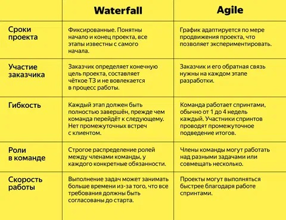

# Гибкие и негибкие подходы к разработке ПО

В процессе разработки программного обеспечения используются различные подходы к управлению проектом. Они делятся на **негибкие (предсказуемые)** и **гибкие (адаптивные)**. Выбор подхода зависит от стабильности требований, объёма проекта, вовлечённости заказчика и других факторов.

---

## 🧱 Негибкие (предсказуемые) подходы

**Определение:**  
Это подходы, в которых все стадии проекта строго определены и следуют друг за другом. Требования фиксируются в начале проекта и не меняются в процессе разработки.

### 🔹 Пример: Waterfall (каскадная модель)

**Этапы:**  
1. Сбор и документирование требований  
2. Проектирование архитектуры  
3. Реализация (кодирование)  
4. Тестирование  
5. Внедрение  
6. Поддержка

**Особенности:**  
- Чёткое разделение этапов  
- Возврат к предыдущему этапу затруднён  
- Все требования известны заранее

**Преимущества:**  
- Простота управления  
- Хорошо подходит для проектов с чёткими требованиями  
- Легче контролировать сроки и бюджет

**Недостатки:**  
- Не гибкий к изменениям  
- Поздняя обратная связь от заказчика  
- Возможность «сюрпризов» на этапе тестирования

---

## ⚡ Гибкие (Agile) подходы

**Определение:**  
Гибкие подходы предполагают **итеративную и инкрементальную разработку**. Требования могут меняться по ходу проекта. Основной акцент — на сотрудничество, работающий продукт и быструю обратную связь.

### 🔹 Пример: Scrum

**Роли:**  
- **Product Owner** — владелец продукта, определяет приоритеты  
- **Scrum Master** — помогает команде соблюдать Scrum  
- **Команда разработки** — реализует задачи

**Процесс:**  
1. Формирование Backlog (список требований)  
2. Разработка короткими итерациями (спринтами, 1–4 недели)  
3. На каждый спринт выбирается часть задач  
4. В конце — демонстрация результата и ретроспектива

**Особенности:**  
- Быстрая поставка ценности  
- Обратная связь в каждом спринте  
- Требования уточняются по ходу

**Преимущества:**  
- Гибкость и адаптация к изменениям  
- Ранний и частый релиз рабочих версий  
- Высокая вовлечённость заказчика

**Недостатки:**  
- Сложно предсказать сроки и бюджет заранее  
- Требует зрелой команды и дисциплины  
- Не всегда подходит для жёстко регламентированных отраслей

---

## 🆚 Сравнительная таблица

| Критерий                  | Waterfall                        | Scrum (Agile)                   |
|---------------------------|----------------------------------|----------------------------------|
| **Гибкость требований**    | Нет, требования фиксируются      | Есть, требования адаптируются   |
| **Фазы разработки**        | Последовательные                 | Итеративные                     |
| **Обратная связь**         | В конце проекта                  | На каждом спринте               |
| **Документация**           | Обширная                         | Минимально необходимая          |
| **Подходит для**           | Предсказуемых проектов           | Быстро меняющихся условий       |
| **Оценка времени и бюджета** | Легче спрогнозировать           | Труднее спрогнозировать         |
| **Участие заказчика**      | Минимальное                      | Активное                         |
| **Поставляемый результат** | Один финальный продукт           | Частично готовый продукт каждые 1–4 недели |

---

## 📊 Критерии выбора подхода

| Условие                                      | Рекомендуемый подход |
|----------------------------------------------|----------------------|
| Требования стабильны и не будут меняться     | Waterfall            |
| Требования могут измениться в процессе       | Agile (Scrum, Kanban)|
| Нужно много документации (гос. проекты)      | Waterfall            |
| Быстрая обратная связь от клиента важна      | Agile                |
| В команде есть опыт самоорганизации          | Agile                |
| Много внешних зависимостей и контрактов      | Waterfall            |

---

## 🧪 Другие гибкие методологии

| Методология | Краткое описание |
|-------------|------------------|
| **Kanban**  | Управление задачами на доске, непрерывный поток работы |
| **XP (Extreme Programming)** | Акцент на качество кода и парное программирование |
| **Lean**    | Сокращение потерь, быстрая доставка ценности |
| **SAFe**    | Масштабируемый Agile для больших организаций |

---

## 📚 Рекомендуемые ресурсы

- [Agile Manifesto](https://agilemanifesto.org)  
- [Scrum Guide](https://scrumguides.org)  
- PMBOK Guide (Waterfall): от PMI  
- Книга «Agile Project Management» — Jim Highsmith  
- Книга «Scrum: The Art of Doing Twice the Work in Half the Time» — Jeff Sutherland